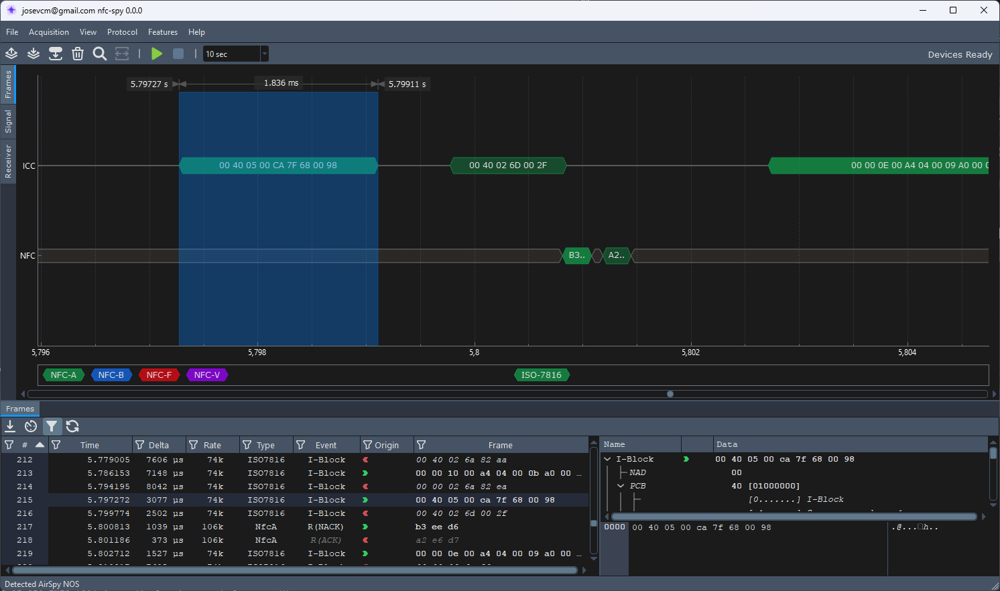
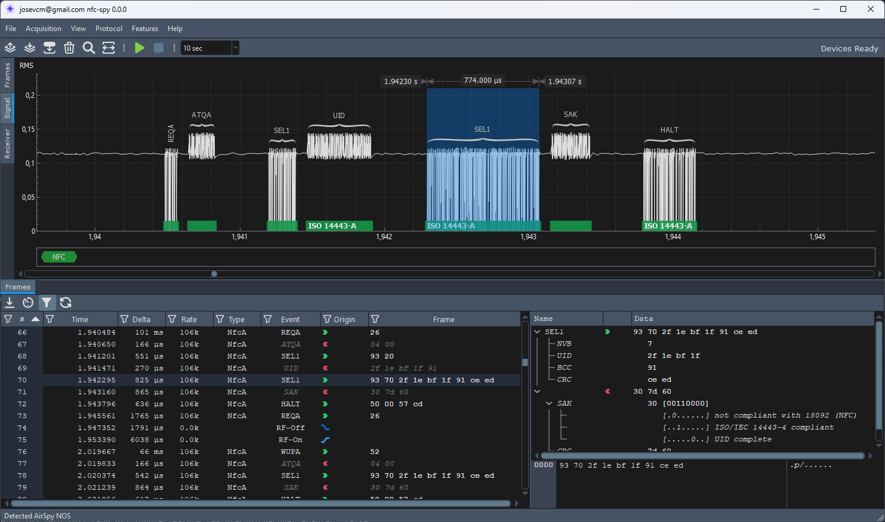
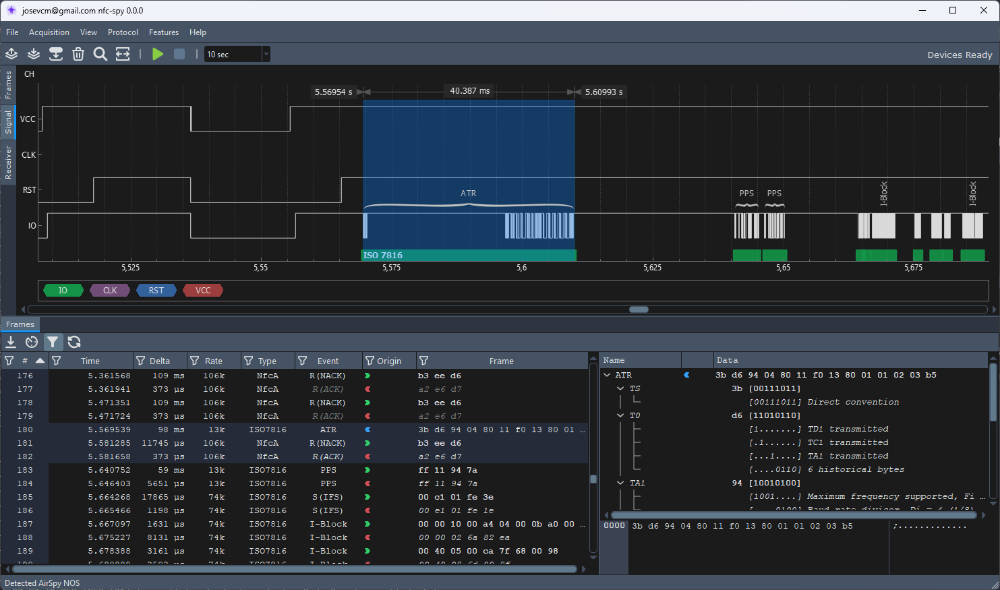
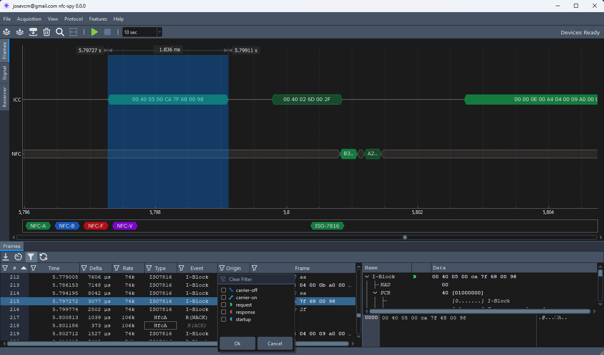
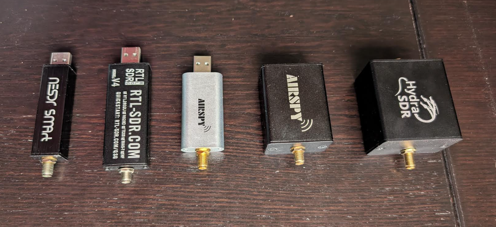
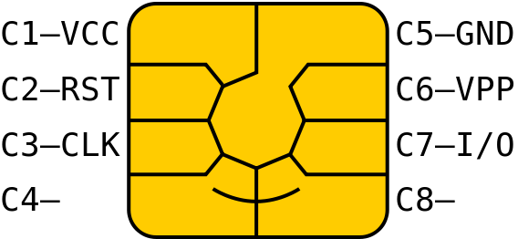

# SDR nfc-laboratory 3

NFC signal sniffer and protocol decoder using SDR receiver for demodulation and decoding NFC-A, NFC-B, NFC-F and NFC-V
signals in real-time up to 424 Kbps. Logic analyzer for contact smart cards with protocol ISO7816.

## Features

- NFC Real-time signal capture and demodulation.
- ISO7816 Real-time signal capture and decode.
- Radio decoder for contactless ISO14443-A, ISO14443-B, ISO15693 and ISO18092.
- Logic decoder for contact smart cards with protocol ISO7816.
- Signal analysis and protocol timing.
- Signal spectrum and wave view.
- Signal frame and protocol detail view.
- Signal export captures to compressed TRZ format.
- Signal import from WAV and compressed TRZ format.
- Support for AirSpy and RTL-SDR receivers.
- Support for DreamSourceLab DSLogic Plus, Pro16 and Pro32 logic analyzer.

## Description

By using an SDR receiver it is possible to capture, demodulate and decode the NFC signal between the card and the
reader.

Currently, detection and decoding is implemented for:

- NFC-A (ISO14443A): 106kbps, 212kbps and 424kbps with ASK / BPSK modulation.
- NFC-B (ISO14443B): 106kbps, 212kbps and 424kbps with ASK / BPSK modulation.
- NFC-V (ISO15693): 26kbps and 53kbps, 1 of 4 code and 1 of 256 code PPM / BPSK modulation (pending FSK).
- NFC-F (ISO18092): Preliminary support to 212kbps and 424kbps with manchester modulation.

For contact smart cards, the ISO7816 protocol is implemented with the help of a logic analyzer from DreamSourceLab.

## Application screenshots

Main signal view.




NFC wave detail view.



ISO7816 wave detail view.



Radio spectrum view.


Protocol detail view and filtering capabilities.




As can be seen, the application split functionalities in different tabs:

- At the top left:
  - **Frames**: Graphic view for decoded frames captured in contact interface and contactless interface.
  - **Signal**: Shows the raw signal captured with logic analyzer and the radio interface with protocol markers.
  - **Receiver**: During acquire shows the spectrum of the signal captured in the radio interface.
  - 
- At the bottom:
  - **Frames**: Table view for decoded frames captured in contact interface and contactless interface.

## Application settings

Settings are stored in user home directory, inside Roaming folder for windows %USERPROFILE%\AppData\Roaming\josevcm\nfc-spy.ini.
The file is created the first time the application is run and can contain the following sections:

Window state, updated every application close.

```
[window]
timeFormat=false
followEnabled=true
filterEnabled=true
windowWidth=1024
windowHeight=700
```

Logic decoder and ISO7816 status, controlled from the toolbar option **Logic Acquire**, **Logic Decoder** under **Features** and **Protocol** menu. 
Currently, channel signal mappings **channelIO**, **channelCLK**, **channelRST**, **channelVCC** are fixed, change this values has no effect.

```
[decoder.logic]
enabled=true

[decoder.logic.protocol.iso7816]
enabled=true
channelIO=0
channelCLK=1
channelRST=2
channelVCC=3
```

Radio decoder and NFC-A, NFC-B, NFC-F, NFC-V status, controlled from the toolbar option **Radio Acquire**, **Radio Decoder** under **Features** and **Protocol** menu.
Currently, channel signal mappings **channelIO**, **channelCLK**, **channelRST**, **channelVCC** are fixed, change this values has no effect.

```
[decoder.radio]
enabled=true

[decoder.radio.protocol.nfca]
enabled=true

[decoder.radio.protocol.nfcb]
enabled=true

[decoder.radio.protocol.nfcf]
enabled=true

[decoder.radio.protocol.nfcv]
enabled=true
```

Configuration parameters for the Airspy receiver, the best performance is obtained by tuning in 3rd harmonic
at 40.68Mhz.

```
[device.radio.airspy]
centerFreq=40680000
sampleRate=10000000
gainMode=1
gainValue=4
mixerAgc=0
tunerAgc=0
biasTee=0
directSampling=0
enabled=true
```

Configuration parameters for the RTL-SDR receiver, the best performance is obtained by tuning to the 2nd harmonic
at 27.12Mhz. Decoding with this device is quite limited due to its low sampling frequency and 8-bit resolution,
it will not offer the necessary quality, is supported only as a reference to experiment with it.

```
[device.radio.rtlsdr]
centerFreq=27120000
sampleRate=3200000
gainMode=-1
gainValue=229
biasTee=0
directSampling=0
mixerAgc=0
tunerAgc=0
```

Logging control to see what happened.

```
[logger]
root=WARN
app.main=INFO
app.qt=INFO
decoder.IsoDecoder=WARN
decoder.Iso7816=WARN
decoder.NfcDecoder=WARN
decoder.NfcA=WARN
decoder.NfcB=WARN
decoder.NfcF=WARN
decoder.NfcV=WARN
worker.FourierProcess=WARN
worker.LogicDecoder=INFO
worker.LogicDevice=INFO
worker.RadioDecoder=INFO
worker.RadioDevice=INFO
worker.SignalResampling=WARN
worker.SignalStorage=WARN
worker.TraceStorage=WARN
hw.AirspyDevice=WARN
hw.MiriDevice=WARN
hw.RealtekDevice=WARN
hw.RecordDevice=WARN
hw.DSLogicDevice=WARN
hw.DeviceFactory=WARN
hw.UsbContext=WARN
hw.UsbDevice=WARN
rt.Executor=INFO
rt.Worker=INFO
```

All default values are fixed and can be enough for most of the cases.

## SDR Receivers tested

I have tried several receivers obtaining the best results with AirSpy Mini, I do not have more devices, but surely it
works with others.

- AirSpy Mini or R2: Better results, tuning the third harmonic at 40.68Mhz, with a sampling frequency of 10 Mbps, 
  with these parameters it is possible to capture the communication up to 424 Kbps.

- RTL SDR: It works by tuning the second harmonic at 27.12Mhz, due to the limitation in the maximum sampling frequency 
  of 3Mbps and its 8 bits of resolution only allows you to capture the commands up to 106Kbps and some responses in 
  very clean signals.

Receivers tested:



Nooelec RTL-SDR with HydraNFC calibration coil:


AirSpy with custom antenna and ARC122U reader:


### Driver Setup for RTL-SDR

You can found instructions under https://www.rtl-sdr.com/rtl-sdr-quick-start-guide/

### Upconverters & Bias-tee

To avoid tuning harmonics it is possible to use an up-converter and thus tune directly to the carrier 
frequency of 13.56Mhz. Currently, biasTee is only supported for AirSpy in combination with SpyVerter thanks to [Benjamin DELPY](https://github.com/gentilkiwi). 

The configuration required is:

```
[device.airspy]
gainMode=0
gainValue=4
tunerAgc=false
mixerAgc=false
biasTee=1
centerFreq=133560000
sampleRate=10000000
```
### Direct Sampling mode

Another way to avoid using harmonics is activate direct sampling mode and tune to the carrier frequency of 13.56Mhz in those devices that allow it. 
Currently it is only available for RTLSDR thanks to the contribution of [Vincent Långström](https://github.com/vinicentus). You can use direct 
sampling on either the Q- or I-branch. The Q-branch is preferred due to better results, set the Q-branch with directSampling=2 and the I-branch 
with directSampling=1, directSampling=0 turns off direct sampling.

Note: No all RTLSDR devices support this feature.

The configuration required is:

```
[device.rtlsdr]
...
centerFreq=13560000
directSampling=1
...
```

## Logic Analyzer tested

The only tested LA is DreamSourceLab DSLogic Plus, it works perfectly with the app, Pro16 and Pro32 are also supported but not tested (I don't have one).
Firmware files for this LA are included in the repository, you can find them in the **dat/firmware** folder, this files must
be located inside firmware folder along nfc-spy.exe application. Thanks to [DreamSourceLab](https://www.dreamsourcelab.com/product/dslogic-series/).


The channel connections required to decode ISO7816 protocol are:

- Channel 0: IO
- Channel 1: CLK
- Channel 2: RST
- Channel 3: VCC



I use a simple adapter to connect the smart card to the logic analyzer from aliexpress.


## Hardware requirements and performance

The demodulator is designed to run in real time, so it requires a recent computer with a lot of processing capacity.

I have opted for a mixed approach where some optimizations are sacrificed in favor of maintaining 
clarity in the code and facilitating its monitoring and debugging.

For this reason it is possible that certain parts can be improved in performance, but I have done it as a didactic 
exercise rather than a production application.

## Input / Output file formats

The application allows you to read and write files in two different formats:

- WAV: Reading signals in standard WAV format with 1 or 2 channels for NFC signals and 4 channels for logic analyzer 
  signals. 

  - Radio signal with 1 channel should contain samples in absolute real values. If 2 channels are used they should contain the sampling of the I / Q components.
  - Logic signal with 4 channels should contain the sampling of the IO, CLK, RST and VCC signals in that order.

- TRZ: The analyzed signal can be stored and read from a compressed format based on TGZ with contains:

  - Signal data in custom binary format.
  - Signal metadata in JSON format.

JSON contents are in entry named **frame.json** inside TRZ file:

```
{
   "frames": [
      {
          "dateTime": 1731144155.0108738,
          "frameData": "05:00:08:39:73",
          "frameFlags": 0,
          "framePhase": 257,
          "frameRate": 105938,
          "frameType": 258,
          "sampleEnd": 115545,
          "sampleRate": 10000000,
          "sampleStart": 108739,
          "techType": 258,
          "timeEnd": 0.0115545,
          "timeStart": 0.0108739
      },
...
}
```

- datetime: Date and time of the frame in seconds since epoch
- frameData: Data of the frame in hexadecimal format.
- frameFlags: Flags of the frame, a combination of the following values:
  - ShortFrame = 0x01
  - Encrypted = 0x02
  - Truncated = 0x08
  - ParityError = 0x10
  - CrcError = 0x20
  - SyncError = 0x40
- framePhase: Phase of the frame, one of the following values:
  - NfcCarrierPhase = 0x0100
  - NfcSelectionPhase = 0x0101
  - NfcApplicationPhase = 0x0102
- frameRate: Rate of the frame, in bits per second, one of the following values
- frameType: Type of the frame, one of the following values:
  - NfcCarrierOff = 0x0100
  - NfcCarrierOn = 0x0101
  - NfcPollFrame = 0x0102
  - NfcListenFrame = 0x0103
  - IsoATRFrame = 0x0201
  - IsoRequestFrame = 0x0211
  - IsoResponseFrame = 0x0212
  - IsoExchangeFrame = 0x0213
- sampleStart: Start of the frame in samples.
- sampleEnd: End of the frame in samples.
- techType: Type of technology, one of the following values:
  - NoneTech = 0x0000
  - NfcAnyTech = 0x0100
  - NfcATech = 0x0101
  - NfcBTech = 0x0102
  - NfcFTech = 0x0103
  - NfcVTech = 0x0104
  - IsoAnyTech = 0x0200
  - Iso7816Tech = 0x0201
- timeEnd: End of the frame in seconds.
- timeStart: Start of the frame in seconds.

## Testing files

In the "wav" folder you can find a series of samples of different captures for the NFC-A, NFC-B, NFC-F and NFC-V 
modulations with their corresponding analysis inside the "json" files.

These files can be opened directly from the NFC-LAB application through the toolbar to see their analysis, but the 
main objective is to pass the unit tests and check the correct operation of the decoder.

To run the unit tests, the **test-sdr** artifact must be compiled and launched using the path to the "wav" folder 
as an argument, for example:

```
test-sdr.exe ../wav/
TEST FILE "test_NFC-A_106kbps_001.wav": PASS
TEST FILE "test_NFC-A_106kbps_002.wav": PASS
TEST FILE "test_NFC-A_106kbps_003.wav": PASS
TEST FILE "test_NFC-A_106kbps_004.wav": PASS
TEST FILE "test_NFC-A_212kbps_001.wav": PASS
TEST FILE "test_NFC-A_424kbps_001.wav": PASS
TEST FILE "test_NFC-A_424kbps_002.wav": PASS
TEST FILE "test_NFC-B_106kbps_001.wav": PASS
TEST FILE "test_NFC-B_106kbps_002.wav": PASS
TEST FILE "test_NFC-F_212kbps_001.wav": PASS
TEST FILE "test_NFC-F_212kbps_002.wav": PASS
TEST FILE "test_NFC-V_26kbps_001.wav": PASS
TEST FILE "test_NFC-V_26kbps_002.wav": PASS
TEST FILE "test_POLL_ABF_001.wav": PASS
TEST FILE "test_POLL_AB_001.wav": PASS
```

## Build instructions

This project is based on Qt6 and MinGW-W64 and contains the following components:

- /src/nfc-app/app-qt: Application interface based on Qt Widgets
- /src/nfc-app/app-rx: Command line decoder application.
- /src/nfc-lib/lib-ext: External libraries and drivers for SDR and logic analyzer.
- /src/nfc-lib/lib-hw: Hardware abstraction layer for SDR and logic analyzer.
- /src/nfc-lib/lib-lab: Signal processing and protocol decoding.
- /src/nfc-lib/lib-rt: Runtime utilities and thread management.

All can be compiled with mingw-g64, a minimum version is required to support C++17, recommended 11.0 or higher.

### Prerequisites

- Qt6 framework 6.x, see https://www.qt.io/offline-installers
- A recent mingw-w64 11 for windows build, see https://www.mingw-w64.org/downloads
- A GCC / G++ for Linux build, version 11.0 or later
- CMake version 3.16 or higher, see http://www.cmake.org/cmake/resources/software.html
- Git-bash or your preferred client for Windows build, see https://gitforwindows.org/

### Manual build for Windows

Once you have all pre-requisites ready, download repository:

```
$ git clone https://github.com/josevcm/nfc-laboratory.git
Cloning into 'nfc-laboratory'...
remote: Enumerating objects: 1629, done.
remote: Counting objects: 100% (1003/1003), done.
remote: Compressing objects: 100% (776/776), done.
remote: Total 1629 (delta 188), reused 990 (delta 179), pack-reused 626
Receiving objects: 100% (1629/1629), 32.09 MiB | 10.60 MiB/s, done.
Resolving deltas: 100% (312/312), done.
Updating files: 100% (975/975), done.
```

Prepare release makefiles, or change `CMAKE_BUILD_TYPE=Debug` and `-B cmake-build-debug` for debug output:

```
$ cmake.exe -DCMAKE_BUILD_TYPE=Release -G "CodeBlocks - MinGW Makefiles" -S nfc-laboratory -B cmake-build-release
-- The C compiler identification is GNU 8.1.0
-- The CXX compiler identification is GNU 8.1.0
-- Detecting C compiler ABI info
-- Detecting C compiler ABI info - done
-- Check for working C compiler: D:/develop/mingw-w64/x86_64-8.1.0-posix-seh-rt_v6-rev0/mingw64/bin/gcc.exe - skipped
-- Detecting C compile features
-- Detecting C compile features - done
-- Detecting CXX compiler ABI info
-- Detecting CXX compiler ABI info - done
-- Check for working CXX compiler: D:/develop/mingw-w64/x86_64-8.1.0-posix-seh-rt_v6-rev0/mingw64/bin/g++.exe - skipped
-- Detecting CXX compile features
-- Detecting CXX compile features - done
-- USB_LIBRARY: C:/Users/jvcampos/build/nfc-laboratory/dll/usb-1.0.26/x86_64-w64-mingw32/lib/libusb-1.0.dll.a
-- GLEW_LIBRARY: C:/Users/jvcampos/build/nfc-laboratory/dll/glew-2.1.0/x86_64-w64-mingw32/lib/libglew32.dll.a
-- FT_LIBRARY: C:/Users/jvcampos/build/nfc-laboratory/dll/freetype-2.11.0/x86_64-w64-mingw32/lib/libfreetype.dll.a
-- Configuring done
-- Generating done
-- Build files have been written to: C:/Users/jvcampos/build/cmake-build-release
```

Launch build:

```
$ cmake.exe --build cmake-build-release --target nfc-lab -- -j 6
Scanning dependencies of target mufft-sse
Scanning dependencies of target mufft-sse3
Scanning dependencies of target rt-lang
Scanning dependencies of target mufft-avx
Scanning dependencies of target airspy
Scanning dependencies of target rtlsdr
[  1%] Building C object src/nfc-lib/lib-ext/mufft/CMakeFiles/mufft-sse.dir/src/main/cpp/x86/kernel.sse.c.obj
[  2%] Building C object src/nfc-lib/lib-ext/mufft/CMakeFiles/mufft-sse3.dir/src/main/cpp/x86/kernel.sse3.c.obj
[  3%] Building C object src/nfc-lib/lib-ext/mufft/CMakeFiles/mufft-avx.dir/src/main/cpp/x86/kernel.avx.c.obj
[  4%] Building CXX object src/nfc-lib/lib-rt/rt-lang/CMakeFiles/rt-lang.dir/src/main/cpp/Executor.cpp.obj
[  4%] Building C object src/nfc-lib/lib-ext/airspy/CMakeFiles/airspy.dir/src/main/cpp/airspy.c.obj
[  5%] Building C object src/nfc-lib/lib-ext/rtlsdr/CMakeFiles/rtlsdr.dir/src/main/cpp/librtlsdr.c.obj
....
[100%] Linking CXX executable nfc-lab.exe
[100%] Built target nfc-lab
```

#### Prepare Qt deployment

To run the application correctly it is necessary to deploy the Qt components together with the libraries and the generated artifact.

```
mkdir qt-deploy
cp nfc-laboratory/dll/usb-1.0.26/x86_64-w64-mingw32/bin/*.dll qt-deploy/
cp cmake-build-release/src/nfc-app/app-qt/nfc-lab.exe qt-deploy/
```

Run `windeployqt.exe` tool to create required folders and copy required Qt DLLs

```
$ windeployqt.exe --release --compiler-runtime --no-translations --no-system-d3d-compiler --no-angle --no-opengl-sw qt-deploy/nfc-spy.exe
C:\Users\jvcampos\build\qt-deploy\nfc-spy.exe 64 bit, release executable
Adding Qt5Svg for qsvgicon.dll
Direct dependencies: Qt5Core Qt5Gui Qt5PrintSupport Qt5Widgets
All dependencies   : Qt5Core Qt5Gui Qt5PrintSupport Qt5Widgets
To be deployed     : Qt5Core Qt5Gui Qt5PrintSupport Qt5Svg Qt5Widgets
Updating Qt5Core.dll.
Updating Qt5Gui.dll.
Updating Qt5PrintSupport.dll.
Updating Qt5Svg.dll.
Updating Qt5Widgets.dll.
Updating libgcc_s_seh-1.dll.
Updating libstdc++-6.dll.
Updating libwinpthread-1.dll.
Patching Qt5Core.dll...
Creating directory C:/Users/jvcampos/build/qt-deploy/iconengines.
Updating qsvgicon.dll.
Creating directory C:/Users/jvcampos/build/qt-deploy/imageformats.
Updating qgif.dll.
Updating qicns.dll.
Updating qico.dll.
Updating qjpeg.dll.
Updating qsvg.dll.
Updating qtga.dll.
Updating qtiff.dll.
Updating qwbmp.dll.
Updating qwebp.dll.
Creating directory C:/Users/jvcampos/build/qt-deploy/platforms.
Updating qwindows.dll.
Creating directory C:/Users/jvcampos/build/qt-deploy/printsupport.
Updating windowsprintersupport.dll.
Creating directory C:/Users/jvcampos/build/qt-deploy/styles.
Updating qwindowsvistastyle.dll.
```

Application is ready to use!

If you do not have an SDR receiver, I have included a small capture sample signal in file "wav/capture-424kbps.wav" that
serves as an example to test demodulation.

### Manual build for Linux

Install dependencies

```
user@LG:~# sudo apt install cmake g++ g++-11 qt6-base-dev libusb-1.0-0-dev zlib1g-dev libgl1-mesa-dev
```

Download repository:

```
user@LG:~$ git clone https://github.com/josevcm/nfc-laboratory.git
Cloning into 'nfc-laboratory'...
remote: Enumerating objects: 8903, done.
remote: Counting objects: 100% (229/229), done.
remote: Compressing objects: 100% (91/91), done.
remote: Total 8903 (delta 139), reused 181 (delta 130), pack-reused 8674 (from 1)
Receiving objects: 100% (8903/8903), 76.69 MiB | 4.03 MiB/s, done.
Resolving deltas: 100% (3911/3911), done.
```

Prepare release makefiles, or change `CMAKE_BUILD_TYPE=Debug` and `-B cmake-build-debug` for debug output:

```
user@LG:~$ cmake -DCMAKE_BUILD_TYPE=Release -S nfc-laboratory -B cmake-build-release
-- The C compiler identification is GNU 11.4.0
-- The CXX compiler identification is GNU 11.4.0
-- Detecting C compiler ABI info
-- Detecting C compiler ABI info - done
-- Check for working C compiler: /usr/bin/cc - skipped
-- Detecting C compile features
-- Detecting C compile features - done
-- Detecting CXX compiler ABI info
-- Detecting CXX compiler ABI info - done
-- Check for working CXX compiler: /usr/bin/c++ - skipped
-- Detecting CXX compile features
-- Detecting CXX compile features - done
-- Build for x86_64
-- Enabled SSE/SSE3 instruction set
-- usb-1.0:
--   include:/usr/include/libusb-1.0
--   library:/usr/lib/x86_64-linux-gnu/libusb-1.0.so
-- Looking for pthread.h
-- Looking for pthread.h - found
-- Performing Test CMAKE_HAVE_LIBC_PTHREAD
-- Performing Test CMAKE_HAVE_LIBC_PTHREAD - Success
-- Found Threads: TRUE
-- Performing Test HAVE_STDATOMIC
-- Performing Test HAVE_STDATOMIC - Success
-- Found WrapAtomic: TRUE
-- Found OpenGL: /usr/lib/x86_64-linux-gnu/libOpenGL.so
-- Found WrapOpenGL: TRUE
-- Could NOT find XKB (missing: XKB_LIBRARY XKB_INCLUDE_DIR) (Required is at least version "0.5.0")
-- Could NOT find WrapVulkanHeaders (missing: Vulkan_INCLUDE_DIR)
-- Configuring done
-- Generating done
-- Build files have been written to: /home/user/cmake-build-release
```

Launch build:

```
user@LG:~$ cmake --build cmake-build-release --target nfc-spy -- -j 6
[  0%] Building C object src/nfc-lib/lib-ext/airspy/CMakeFiles/airspy.dir/src/main/c/airspy.c.o
[  0%] Building C object src/nfc-lib/lib-ext/mufft/CMakeFiles/mufft-avx.dir/src/main/c/x86/kernel.avx.c.o
[  0%] Building C object src/nfc-lib/lib-ext/ed25519/CMakeFiles/ed25519.dir/src/main/c/add_scalar.c.o
[  0%] Building C object src/nfc-lib/lib-ext/mufft/CMakeFiles/mufft-sse.dir/src/main/c/x86/kernel.sse.c.o
[  2%] Building C object src/nfc-lib/lib-ext/microtar/CMakeFiles/microtar.dir/src/main/c/microtar.c.o
[  1%] Building C object src/nfc-lib/lib-ext/mufft/CMakeFiles/mufft-sse3.dir/src/main/c/x86/kernel.sse3.c.o
[  3%] Building C object src/nfc-lib/lib-ext/ed25519/CMakeFiles/ed25519.dir/src/main/c/fe.c.o
[  4%] Linking C static library libmicrotar.a
[  4%] Built target microtar
[  5%] Building C object src/nfc-lib/lib-ext/ed25519/CMakeFiles/ed25519.dir/src/main/c/ge.c.o
[  6%] Building C object src/nfc-lib/lib-ext/rtlsdr/CMakeFiles/rtlsdr.dir/src/main/c/librtlsdr.c.o
[  7%] Building C object src/nfc-lib/lib-ext/airspy/CMakeFiles/airspy.dir/src/main/c/iqconverter_float.c.o
[  7%] Building C object src/nfc-lib/lib-ext/ed25519/CMakeFiles/ed25519.dir/src/main/c/key_exchange.c.o
[  8%] Linking C static library libmufft-sse.a
[  8%] Linking C static library libmufft-sse3.a
[  8%] Built target mufft-sse
[  8%] Built target mufft-sse3
[  9%] Building C object src/nfc-lib/lib-ext/ed25519/CMakeFiles/ed25519.dir/src/main/c/keypair.c.o
[  9%] Building C object src/nfc-lib/lib-ext/ed25519/CMakeFiles/ed25519.dir/src/main/c/sc.c.o
[ 10%] Building C object src/nfc-lib/lib-ext/ed25519/CMakeFiles/ed25519.dir/src/main/c/seed.c.o
[ 11%] Building C object src/nfc-lib/lib-ext/ed25519/CMakeFiles/ed25519.dir/src/main/c/sha512.c.o
[ 11%] Building C object src/nfc-lib/lib-ext/airspy/CMakeFiles/airspy.dir/src/main/c/iqconverter_int16.c.o
[ 13%] Building C object src/nfc-lib/lib-ext/mirisdr/CMakeFiles/mirisdr.dir/src/main/c/libmirisdr.c.o
[ 14%] Linking C static library libairspy.a
[ 14%] Building C object src/nfc-lib/lib-ext/ed25519/CMakeFiles/ed25519.dir/src/main/c/sign.c.o
[ 14%] Built target airspy
[ 15%] Linking C static library libmufft-avx.a
[ 16%] Building C object src/nfc-lib/lib-ext/ed25519/CMakeFiles/ed25519.dir/src/main/c/verify.c.o
....
[ 94%] Building CXX object src/nfc-app/app-qt/CMakeFiles/nfc-spy.dir/src/main/cpp/styles/Theme.cpp.o
[ 95%] Building CXX object src/nfc-app/app-qt/CMakeFiles/nfc-spy.dir/src/main/cpp/3party/customplot/QCustomPlot.cpp.o
[ 95%] Building CXX object src/nfc-app/app-qt/CMakeFiles/nfc-spy.dir/src/main/cpp/parser/Parser.cpp.o
[ 96%] Building CXX object src/nfc-app/app-qt/CMakeFiles/nfc-spy.dir/nfc-spy_autogen/R4D6QHBSUY/qrc_icons.cpp.o
[ 97%] Building CXX object src/nfc-app/app-qt/CMakeFiles/nfc-spy.dir/nfc-spy_autogen/BZPGUHF7SV/qrc_style.cpp.o
[ 97%] Building CXX object src/nfc-app/app-qt/CMakeFiles/nfc-spy.dir/nfc-spy_autogen/W56BXCATTS/qrc_icons.cpp.o
[ 98%] Building CXX object src/nfc-app/app-qt/CMakeFiles/nfc-spy.dir/nfc-spy_autogen/7WXA5J3H5Z/qrc_style.cpp.o
[ 98%] Building CXX object src/nfc-app/app-qt/CMakeFiles/nfc-spy.dir/nfc-spy_autogen/M2ZWUQEUSF/qrc_app.cpp.o
[100%] Linking CXX executable nfc-spy
[100%] Built target nfc-spy
```

Copy base configuration file and launch application

```
user@LG:~$ cp -rf nfc-laboratory/dat/firmware cmake-build-release/src/nfc-app/app-qt/
user@LG:~$ ./cmake-build-release/src/nfc-app/app-qt/nfc-spy
```
## Source code licensing

If you think it is an interesting job or you plan to use it for something please email me and let me know, I
will be happy to exchange experiences, thank you very much.

This project is published under the terms of the GPLv3 license, however there are parts of it subject to other types of
licenses, please check if you are interested in this work.

- AirSpy SDR driver at `src/nfc-lib/lib-ext/airspy` see https://github.com/airspy/airspyone_host
- RTL SDR driver at `src/nfc-lib/lib-ext/rtlsdr` see https://osmocom.org/projects/rtl-sdr
- nlohmann json at `src/nfc-lib/lib-ext/nlohmann` see https://github.com/nlohmann/json
- mufft library at `src/nfc-lib/lib-ext/mufft` see https://github.com/Themaister/muFFT
- QCustomPlot at `src/nfc-app/app-qt/src/main/cpp/3party/customplot` see https://www.qcustomplot.com/
- QDarkStyleSheet at `src/nfc-app/app-qt/src/main/assets/theme` see https://github.com/ColinDuquesnoy/QDarkStyleSheet
- Crapto1 at `src/nfc-lib/lib-ext/crapto1`

## Releases

Precompiled installer for x86 64 bit can be found in repository

# How it works?

## Basic notions of the signals to be analyzed

Normal NFC cards work on the 13.56 Mhz frequency, therefore the first step is receive this signal and demodulate to get
the baseband stream. For this purpose any SDR device capable of tuning this frequency can be used, i have the
fantastic and cheap AirSpy Mini capable of tuning from 24Mhz to 1700Mhz. (https://airspy.com/airspy-mini/)

However, it is not possible to tune 13.56Mhz with this receiver, instead I use the second harmonic at 27.12Mhz or third
at 40.68Mhz with good results.

The received signal will be composed of the I and Q components as in the following image.


From these components the real magnitude is calculated using the classic formula sqrt (I ^ 2 + Q ^ 2). Let's see a capture
of the signal received in baseband (after I/Q to magnitude transform) for the REQA command and its response:


As can be seen, it is a signal modulated in 100% ASK that corresponds to the NFC-A REQA 26h command of the NFC 
specifications, the response of the card uses something called load modulation that manifests as a series of pulses on 
the main signal after the command. This is the most basic modulation, but each of the NFC-A / B / F / V standards has 
its own characteristics.

### NFC-A modulation

The standard corresponds to the ISO14443A specifications which describe the way it is modulated as well as the 
applicable timings.

Reader frames are encoded using 100% ASK with modified miller encoding.


When the speed is 106 Kbps card responses are encoded using manchester scheme with OOK load modulation over a 
subcarrier at 848 KHz.


For higher speeds, 212 kbps, 424 kbps and 848 kbps it uses a NRZ-L with binary phase change modulation, BPSK, over 
same subcarrier.


### NFC-B modulation

The standard corresponds to the ISO14443B specifications which describe the way it is modulated as well as the 
applicable timings.

Reader frames are encoded in 10% ASK using NRZ-L encoding.


Responses from the card are encoded with binary phase change modulation, BPSK, using NRZ-L encoding.


### NFC-F modulation

The standard corresponds to the ISO18092 and JIS.X.6319 specifications which describe the way it is modulated as well 
as the applicable timings.

Support speeds from 212 kbps to 848 kbps, both reader and card frames are encoded using either observed or reversed 
manchester as see below.


Observed manchester modulation.


Reversed manchester modulation.


### NFC-V modulation

The standard corresponds to the ISO15693 specifications which describe the way it is modulated as well as the 
applicable timings.

The coding is based on pulse position modulation (PPM) where the information is encoded by modifying the time when the 
pulse is located within each time slot.

There are two modes, 1 of 4 and 1 of 256, where each symbol encodes 2 and 8 bits respectively, this is the example for 
the first one.


Card responses can be encoded in two different ways depending on the value of bit 0 in the flags field of the request made by VCD. 

If the flags bit 0 = 0, the card will respond using only one subcarrier at fc/32 (423,75 kHz), with OOK modulation, (as in NFC-A). 
If the flags bit 0 = 1, the card will respond using two subcarriers at fc/32 (423,75 kHz) and fc/28 (484,28 kHz) with 2-FSK modulation. 

NOTE: Currently only the first mode is supported in this software (sorry).

Depending on the encoding, the possible speeds are 26Kbps and 53Kbps, however these cards can be read from greater 
distances.

## Signal processing

Now we are going to see how to decode this.

### First step, prepare base signals

Before starting to decode each of these modulations, it is necessary to start with a series of basic signals that will
help us in the rest of the process.

The concepts that I am going to explain next are very well described on Sam Koblenski's page 
(https://sam-koblenski.blogspot.com/2015/08/everyday-dsp-for-programmers-basic.html) which I recommend you read to 
fully understand all the processes related to the analysis that we are going to carry out.

Remember that the sample received from the SDR receiver is made up of the I / Q values, therefore the first step is to 
obtain the real signal.

Once we have the real signal, it is necessary to eliminate the continuous component (DC) that will greatly facilitate 
the subsequent analysis process. For this we will use a simple IIR filter.

To calculate the modulation depth we need to know the envelope of the signal as if it were not modulated by the pulses 
or sub-carrier, for this we will use a simple slow exponential average.

Finally we will obtain the standard deviation or variance of the signal that will help us to calculate the appropriate detection thresholds
based on the background noise.


An example of each component, x(t), w(t), v(t) and a(t).


### Next, identify the type of modulation needed

As we have seen in the description, the NFC-A / B / F / V standards will use different modulations but all are based on
two basic techniques, amplitude modulation and phase modulation.

For the encoding of each symbol they use Miller, Manchester or NRZ-L. The first two can be detected by correlation
techniques and for NRZ-L it is enough to detect the level of the signal at each point of synchronization, let's see it
in detail.

### Basic notions of signal correlation

The correlation operation is a measure of how much one signal resembles another that serves as a reference. It is used
intensively in digital signal analysis. With analog signals, the correlation of each sample x(t) requires N 
multiplications, therefore a symbol needs N^2 multiplications, being a costly process.

But since the reference signal is digital, it only has two possible values 0 or 1, which greatly simplifies the
calculation by eliminating all the multiplications, allowing the correlation to be carried out by process a simple
moving average.


These would be the two basic symbols that we need to carry out the correlation, if you study a little the operations
that need to be carried out you will see that they are reduced to calculating the mean over the duration of the symbol
and then obtaining the difference between the critical points, t = 0, t = N / 2 and t = N as seen in next diagram.


We will widely use this operation to extract the information within the NFC signals

### Demodulation of ASK miller and manchester signals

For ASK modulated signals, it is enough to carry out the correlation described above on the baseband signal x(t). Below
is the correlation functions for the two basic symbols S0, S1 used to calculate all the others. Last value is function
SD and represent the absolute difference between S0 and S1 necessary to detect the timmings.


When the speed is 106 kbps, the answer can be extracted by applying the same technique, but instead of using the signal
x(t) we will do it with w(t) multiplying it by itself obtaining a measure of the power that we will then integrate
over 1/4 of the symbol period, in such a way that we will obtain a fairly clear ASK signal to be able to apply the
correlation described above, this is the diagram of the process.


Card is much weaker but enough to allow its detection using the same technique for patterns E, D, F,
here it is shown in better scale the process described. From top to bottom the signals are: x(t), w(t), w(t)^2 and y(t).


### Demodulation of BPSK signals

For BPSK demodulation a reference signal is required to detect the phase changes (carrier recovery), since that is
complex I have chosen to implement it by multiplying each symbol by the preceding one, so that it is possible to
determine the value of symbols through the changes produced between then.

It is very important that the signal does not contain a DC shift, therefore the signal w(t) obtained previously
is taken as input to the process.


Below you can see the signal modulated in BPSK for a response frame at 424Kbps, followed by the demodulation y(t) and
integration process over a quarter of a symbol r(t).


Finally, by checking if the result is positive or negative, the value of each symbol can be determined. It is somewhat
more complex since timing and synchronization must be considered but with this signal is straightforward detect symbol
values.

### Symbol detection

From the correlation process we obtain a flow of symbols where it is already possible to apply the specific decoding
defined in each of the standards, NFC-A / B / F / V. Each symbol correlation is evaluated in the appropriate instants
according to the synchronization.

The correlation process begins with the calculation of the S0 and S1 values that represent the basic symbols
subsequently used to discriminate between the NFC patterns X, Y, Z, E, D, F, M, N etc. that are subsequently interpreted 
by a state machine in accordance with the specifications of ISO ISO14443A, ISO14443B, ISO15693 and Felica to obtain a 
byte stream that can be easily processed.


### Bitrate discrimination

So, we have seen how demodulation is performed, but how does this apply when there are different speeds? Well, since we
do not know in advance the transmission speed it is necessary to apply the same process for all possible speeds through
a bank of correlators. Really only is necessary to do it for the first symbol of each frame, once the bitrate is known
the rest are decoded using that speed.


